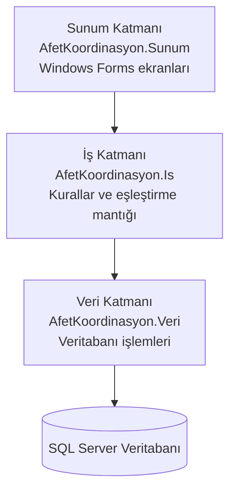
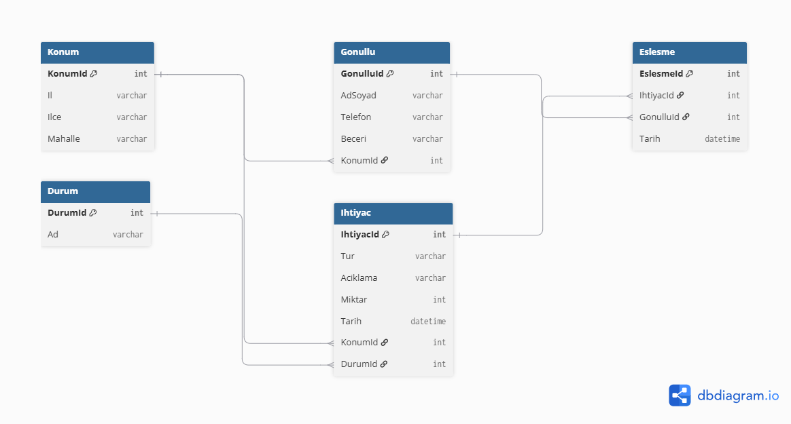

# Afet Sonrası İhtiyaç ve Gönüllü Koordinasyon Sistemi

Afet sonrası ihtiyaçların bildirilmesi, gönüllülerin kaydı ve
ihtiyaçlarla gönüllülerin eşleştirilmesi için geliştirilen bir uygulama.

## Teknolojiler
- C# / .NET
- Visual Studio
- SQL Server (planlanan)

## Mimari
Katmanlı mimari: Sunum - İş - Veri

## Modüller
İhtiyaç bildirimi, gönüllü kaydı, eşleştirme, harita, durum takibi, bildirim

## Geliştirici
Beyzanur Rana Sansar
## Mimari Şema

## ER Diyagramı

## Tablolar Arası İlişkiler

| İlişki | Tür | Açıklama |
|---|---|---|
| Konum → Gonullu | 1-N | Bir konumda birden çok gönüllü bulunabilir. |
| Konum → Ihtiyac | 1-N | Bir konumdan birden çok ihtiyaç bildirilebilir. |
| Durum → Ihtiyac | 1-N | Bir durumda (ör. Bekliyor) birden çok ihtiyaç olabilir. |
| Gonullu → Eslesme | 1-N | Bir gönüllü birden çok eşleşmede yer alabilir. |
| Ihtiyac → Eslesme | 1-N | Bir ihtiyaç birden çok eşleşmede yer alabilir. |
| Gonullu ↔ Ihtiyac | N-N | Bir gönüllü birçok ihtiyaca, bir ihtiyaca birçok gönüllü atanabilir. Bu ilişki **Eslesme** ara tablosu ile kurulmuştur. |
